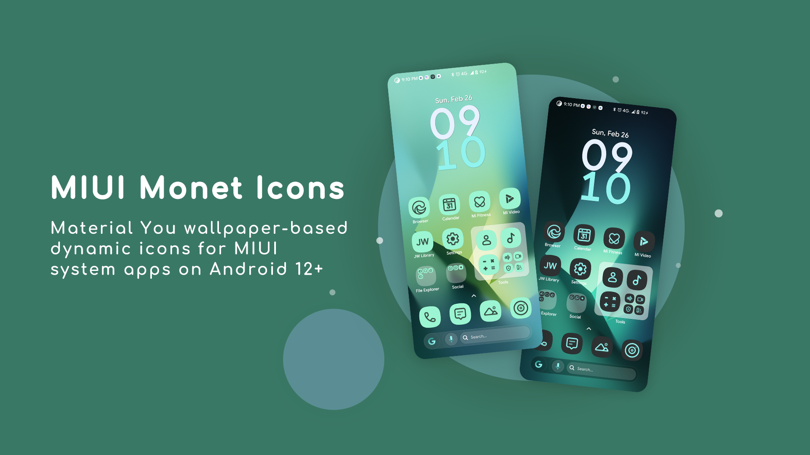

<h1 align="center">MIUI Monet Icons</h1>

Add the beauty of Monet Icons to your MIUI device

   

   
   

   

### MIUI Apps
<table>
  <tr>
    <td align="center" valign="middle">
        
        
Bluetooth &nbsp;

    </td>
    <td align="center" valign="middle">
        
        
Bug Report &nbsp;

    </td>
    <td align="center" valign="middle">
        
        
Calculator &nbsp;

    </td>
    <td align="center" valign="middle">
        
        
Calendar &nbsp;

    </td>
    <td align="center" valign="middle">
        
        
Camera &nbsp;

    </td>
    <td align="center" valign="middle">
        
        
Cleaner (CN)

    </td>
    <td align="center" valign="middle">
        
        
Cleaner (Global)

    </td>
    <td align="center" valign="middle">
        
        
Compass &nbsp;

    </td>
    <td align="center" valign="middle">
        
        
Contacts &nbsp;

    </td>
    <td align="center" valign="middle">
        
        
Dialer &nbsp;

    </td>
  </tr>
  <tr>
    <td align="center" valign="middle">
        
        
Clock  &nbsp;

    </td>
    <td align="center" valign="middle">
        
        
Downloads  &nbsp;

    </td>
    <td align="center" valign="middle">
        
        
Email  &nbsp;

    </td>
    <td align="center" valign="middle">
        
        
File Manager (CN)

    </td>
    <td align="center" valign="middle">
        
        
File Manager (Global)

    </td>
    <td align="center" valign="middle">
        
        
FM Radio &nbsp;

    </td>
    <td align="center" valign="middle">
        
        
Gallery  &nbsp;

    </td>
    <td align="center" valign="middle">
        
        
Getapps (CN) &nbsp;

    </td>
    <td align="center" valign="middle">
        
        
Getapps (Global) &nbsp;

    </td>
    <td align="center" valign="middle">
        
        
Health  &nbsp;

    </td>
  </tr>
  <tr>
    <td align="center" valign="middle">
        
        
Mi AI  &nbsp;

    </td>
    <td align="center" valign="middle">
        
        
Browser (CN) &nbsp;

    </td>
    <td align="center" valign="middle">
        
        
Browser (Global) &nbsp;

    </td>
    <td align="center" valign="middle">
        
        
Mi Home &nbsp;

    </td>
    <td align="center" valign="middle">
        
        
Mi Mover &nbsp;

    </td>
    <td align="center" valign="middle">
        
        
Mi Remote &nbsp;

    </td>
    <td align="center" valign="middle">
        
        
Mi Service &nbsp;

    </td>
    <td align="center" valign="middle">
        
        
Scanner  &nbsp;

    </td>
    <td align="center" valign="middle">
        
        
Messaging  &nbsp;

    </td>
    <td align="center" valign="middle">
        
        
Music  &nbsp;

    </td>
  </tr>
  <tr>
    <td align="center" valign="middle">
        
        
Notes  &nbsp;

    </td>
    <td align="center" valign="middle">
        
        
Screen Recorder &nbsp;

    </td>
    <td align="center" valign="middle">
        
        
Security  &nbsp;

    </td>
    <td align="center" valign="middle">
        
        
Settings  &nbsp;

    </td>
    <td align="center" valign="middle">
        
        
ShareMe  &nbsp;

    </td>
    <td align="center" valign="middle">
        
        
Sound Recorder &nbsp;

    </td>
    <td align="center" valign="middle">
        
        
SIM Toolkit &nbsp;

    </td>
    <td align="center" valign="middle">
        
        
Themes  &nbsp;

    </td>
    <td align="center" valign="middle">
        
        
Mi Video (CN) &nbsp;

    </td>
    <td align="center" valign="middle">
        
        
Mi Video (Global)

    </td>
  </tr>
  <tr>
    <td align="center" valign="middle">
        
        
Weather &nbsp;

    </td>
    <td align="center" valign="middle">
        
        
Automated Tasks

    </td>
    <td align="center" valign="middle">
        
        
Battery Optimization

    </td>
    <td align="center" valign="middle">
        
        
Blocklist &nbsp;

    </td>
    <td align="center" valign="middle">
        
        
Data Usage

    </td>
    <td align="center" valign="middle">
        
        
Game Turbo

    </td>
    <td align="center" valign="middle">
        
        
Mi Fitness

    </td>
    <td align="center" valign="middle">
        
        
Mi Input &nbsp;

    </td>
    <td align="center" valign="middle">
        
        
Mi Store Global

    </td>
    <td align="center" valign="middle">
        
        
Permissions &nbsp;

    </td>
  </tr>
  <tr>
    <td align="center" valign="middle">
        
        
Phone &nbsp;

    </td>
    <td align="center" valign="middle">
        
        
Phone Services

    </td>
    <td align="center" valign="middle">
        
        
Red Envelope

    </td>
    <td align="center" valign="middle">
        
        
Test Network

    </td>
    <td align="center" valign="middle">
        
        
Updater &nbsp;

    </td>

  </tr>
</table>
   

### Google Apps
<table>
  <tr>
    <td align="center" valign="middle">
        
        
Android Auto

    </td>
    <td align="center" valign="middle">
        
        
Assistant &nbsp;

    </td>
    <td align="center" valign="middle">
        
        
Calculator &nbsp;

    </td>
    <td align="center" valign="middle">
        
        
Calendar &nbsp;

    </td>
    <td align="center" valign="middle">
        
        
Chrome &nbsp;

    </td>
    <td align="center" valign="middle">
        
        
Chrome Beta

    </td>
    <td align="center" valign="middle">
        
        
Chrome Dev

    </td>
    <td align="center" valign="middle">
        
        
Chrome Canary

    </td>
    <td align="center" valign="middle">
        
        
Clock

    </td>
    <td align="center" valign="middle">
        
        
Digital Wellbeing

    </td>
  </tr>
  <tr>
    <td align="center" valign="middle">
        
        
Drive &nbsp;

    </td>
    <td align="center" valign="middle">
        
        
Files &nbsp;

    </td>
    <td align="center" valign="middle">
        
        
GBoard &nbsp;

    </td>
    <td align="center" valign="middle">
        
        
Gmail &nbsp;

    </td>
    <td align="center" valign="middle">
        
        
Google &nbsp;

    </td>
    <td align="center" valign="middle">
        
        
Google Meet

    </td>
    <td align="center" valign="middle">
        
        
Google One

    </td>
    <td align="center" valign="middle">
        
        
Google Translate

    </td>
    <td align="center" valign="middle">
        
        
Google TTS

    </td>
    <td align="center" valign="middle">
        
        
Keep Notes

    </td>
  </tr>
  <tr>
    <td align="center" valign="middle">
        
        
Lens &nbsp;

    </td>
    <td align="center" valign="middle">
        
        
Message &nbsp;

    </td>
    <td align="center" valign="middle">
        
        
Phone &nbsp;

    </td>
    <td align="center" valign="middle">
        
        
Photos &nbsp;

    </td>
    <td align="center" valign="middle">
        
        
Play Store

    </td>
    <td align="center" valign="middle">
        
        
Personal Safety

    </td>
    <td align="center" valign="middle">
        
        
Sounds &nbsp;

    </td>
    <td align="center" valign="middle">
        
        
Voice Search

    </td>
    <td align="center" valign="middle">
        
        
Youtube &nbsp;

    </td>
    <td align="center" valign="middle">
        
        
Youtube Music

    </td>
  </tr>
  <tr>
    <td align="center" valign="middle">
        
        
Analytics  &nbsp;

    </td>
    <td align="center" valign="middle">
        
        
Family Link &nbsp;

    </td>
    <td align="center" valign="middle">
        
        
Find My Device &nbsp;

    </td>
    <td align="center" valign="middle">
        
        
Google Authenticator &nbsp;

    </td>
    <td align="center" valign="middle">
        
        
Google Chat &nbsp;

    </td>
    <td align="center" valign="middle">
        
        
Google Contacts &nbsp;

    </td>
    <td align="center" valign="middle">
        
        
Google Docs &nbsp;

    </td>
    <td align="center" valign="middle">
        
        
Google Meet (Original)

    </td>
    <td align="center" valign="middle">
        
        
Google News &nbsp;

    </td>
    <td align="center" valign="middle">
        
        
Google Sheets &nbsp;

    </td>
  </tr>
  <tr>
    <td align="center" valign="middle">
        
        
Google Slides

    </td>
    <td align="center" valign="middle">
        
        
Google Tasks

    </td>
    <td align="center" valign="middle">
        
        
Google Pay

    </td>
    <td align="center" valign="middle">
        
        
Play Console &nbsp;

    </td>
    <td align="center" valign="middle">
        
        
Podcast &nbsp;

    </td>
    <td align="center" valign="middle">
        
        
Snapseed &nbsp;

    </td>
    <td align="center" valign="middle">
        
        
Wallet &nbsp;

    </td>

  </tr>
</table>
   

### Social Media
<table>
  <tr>
    <td align="center" valign="middle">
        
        
Whatsapp &nbsp;

    </td>
    <td align="center" valign="middle">
        
        
GBWhatsapp &nbsp;

    </td>
    <td align="center" valign="middle">
        
        
BGram &nbsp;

    </td>
    <td align="center" valign="middle">
        
        
Discord &nbsp;

    </td>
    <td align="center" valign="middle">
        
        
Facebook &nbsp;

    </td>
    <td align="center" valign="middle">
        
        
Facebook Lite

    </td>
    <td align="center" valign="middle">
        
        
Graph Messenger

    </td>
    <td align="center" valign="middle">
        
        
Instagram &nbsp;

    </td>
    <td align="center" valign="middle">
        
        
Instagram Lite

    </td>
  </tr>
  <tr>
    <td align="center" valign="middle">
        
        
LinkedIn &nbsp;

    </td>
    <td align="center" valign="middle">
        
        
LinkedIn Lite &nbsp;

    </td>
    <td align="center" valign="middle">
        
        
Messenger &nbsp;

    </td>
    <td align="center" valign="middle">
        
        
Messenger Lite

    </td>
    <td align="center" valign="middle">
        
        
Nekogram &nbsp;

    </td>
    <td align="center" valign="middle">
        
        
Nekogram X

    </td>
    <td align="center" valign="middle">
        
        
OK &nbsp;

    </td>
    <td align="center" valign="middle">
        
        
Owlgram &nbsp;

    </td>
    <td align="center" valign="middle">
        
        
Plus Messenger

    </td>
  </tr>
  <tr>
    <td align="center" valign="middle">
        
        
QQ &nbsp;

    </td>
    <td align="center" valign="middle">
        
        
Reddit &nbsp;

    </td>
    <td align="center" valign="middle">
        
        
Signal 

    </td>
    <td align="center" valign="middle">
        
        
Snapchat 

    </td>
    <td align="center" valign="middle">
        
        
Telegram 

    </td>
    <td align="center" valign="middle">
        
        
Telegram Beta

    </td>
    <td align="center" valign="middle">
        
        
Telegram X< &nbsp;

    </td>
    <td align="center" valign="middle">
        
        
Twitch &nbsp;

    </td>
    <td align="center" valign="middle">
        
        
Twitter &nbsp;

    </td>
  </tr>
  <tr>
    <td align="center" valign="middle">
        
        
Twitter Lite

    </td>
    <td align="center" valign="middle">
        
        
VKontakte &nbsp;

    </td>
    <td align="center" valign="middle">
        
        
WeChat &nbsp;

    </td>
    <td align="center" valign="middle">
        
        
Weibo &nbsp;

    </td>
    <td align="center" valign="middle">
        
        
WA Business

    </td>
  </tr>
</table>
   

### Other apps
<table>
  <tr>
    <td align="center" valign="middle">
        
        
Adguard &nbsp;

    </td>
    <td align="center" valign="middle">
        
        
Airbrush &nbsp;

    </td>
    <td align="center" valign="middle">
        
        
Aliexpress &nbsp;

    </td>
    <td align="center" valign="middle">
        
        
APK Editor

    </td>
    <td align="center" valign="middle">
        
        
APKtool M

    </td>
    <td align="center" valign="middle">
        
        
App Manager

    </td>
    <td align="center" valign="middle">
        
        
Bromite &nbsp;

    </td>
    <td align="center" valign="middle">
        
        
Gojek &nbsp;

    </td>
    <td align="center" valign="middle">
        
        
Ice Box

    </td>
    <td align="center" valign="middle">
        
        
Magisk &nbsp;

    </td>
  </tr>
  <tr>
    <td align="center" valign="middle">
        
        
Magisk Delta &nbsp;

    </td>
    <td align="center" valign="middle">
        
        
Material You Colors

    </td>
    <td align="center" valign="middle">
        
        
Mobile Legends &nbsp;

    </td>
    <td align="center" valign="middle">
        
        
Moon Reader &nbsp;

    </td>
    <td align="center" valign="middle">
        
        
Moon Reader Pro

    </td>
    <td align="center" valign="middle">
        
        
MT Manager &nbsp;

    </td>
    <td align="center" valign="middle">
        
        
MT Manager (Canary)

    </td>
    <td align="center" valign="middle">
        
        
Musixmatch  &nbsp;

    </td>
    <td align="center" valign="middle">
        
        
MX Player Pro

    </td>
    <td align="center" valign="middle">
        
        
MX Player Pro

    </td>
  </tr>
  <tr>
    <td align="center" valign="middle">
        
        
SD Maid &nbsp;

    </td>
    <td align="center" valign="middle">
        
        
Simple Reboot

    </td>
    <td align="center" valign="middle">
        
        
Solid Explorer

    </td>
    <td align="center" valign="middle">
        
        
UC Browser

    </td>
    <td align="center" valign="middle">
        
        
Payoneer

    </td>
    <td align="center" valign="middle">
        
        
Spotify

    </td>
  </tr>
</table>

   

<strong>More icons will be added</strong>

